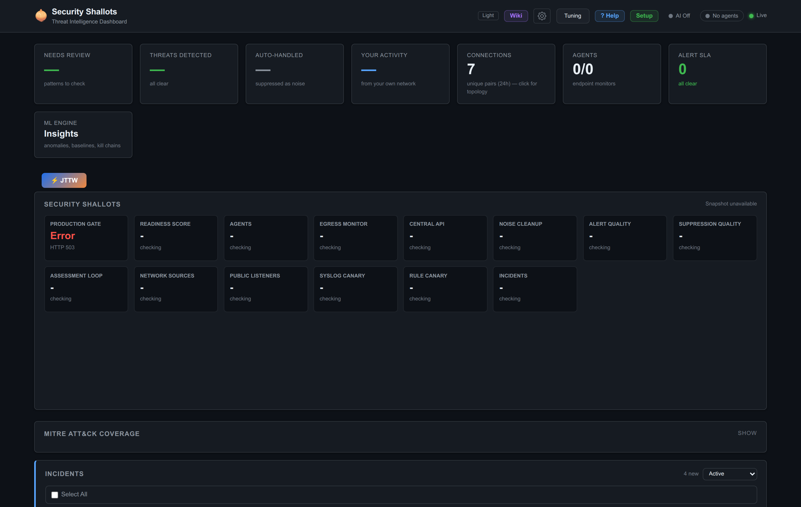
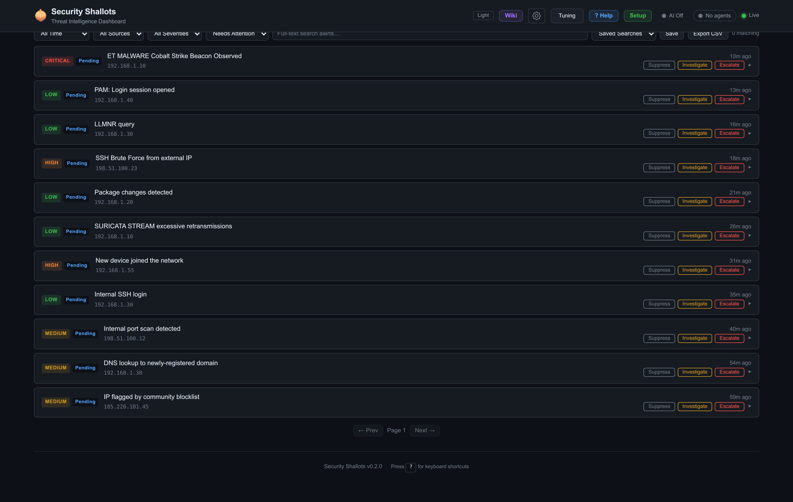
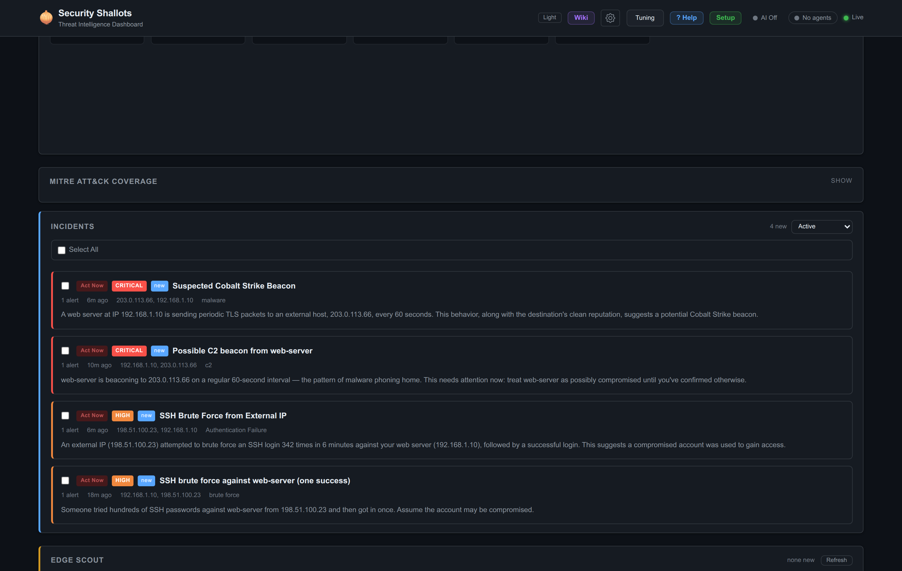

# Security Shallots

Security Shallots is a small-footprint security scout for homelabs and small offices
with roughly 1-10 computers.

It is not trying to be a full Security Onion replacement. It is meant to give a
home operator the useful daily parts of a SIEM/NSM stack without Elasticsearch,
Kibana, a dedicated SOC workflow, or a large server.

The core idea is simple:

- collect high-value network, host, and router signals
- remember what normal looks like for this small fleet
- surface drift, canary touches, unusual first-seen activity, and alert clusters
- preserve short packet evidence when possible
- produce compact scout cards that a human or stronger AI can review

The scout does not make final security judgments. Its job is to escalate things
that might otherwise be missed.

## See It

Your whole small network's security, triaged on one small box. (Shots below are the
built-in demo profile with synthetic data — `python -m tools.demo_seed`.)



**Alerts are triaged, not just dumped.** Known noise (LLMNR, internal SSH, package
updates, stream retransmissions) is suppressed automatically; what's left is ranked by
severity with one-click Suppress / Investigate / Escalate.



**A local LLM turns raw alerts into plain-English incidents** — what happened, why it
matters, and a runbook — running on your own GPU. Nothing leaves your network.



## Best Fit

Shallots is designed for:

- homelabs
- small offices under about 10 computers
- networks with a router/firewall that can send syslog
- a Raspberry Pi 4/5, mini PC, old laptop, or small server
- operators who want useful alerts without running a full SOC stack

It is not designed for:

- enterprise retention/search requirements
- compliance case management
- full packet capture at high throughput
- blind east-west visibility on an unmanaged switched LAN
- replacing EDR on laptops and desktops

## Visibility Matters

Shallots can only analyze traffic and logs it can see.

Recommended placements:

| Placement | What Shallots Sees | Fit |
|---|---|---|
| Router/gateway syslog + DNS logs | Firewall events, DHCP/DNS, WAN edge activity | Best Pi default |
| Managed switch mirror/SPAN port | Mirrored LAN traffic for Suricata/pcap | Best IDS mode |
| Inline gateway/router | Routed traffic through the Shallots box | Advanced |
| Ordinary LAN port only | Mostly the Shallots host's own traffic | Limited |

On many home networks, a Pi plugged into a normal switch port will not see all
device-to-device traffic. In that mode Shallots should be treated as a syslog,
DNS, posture, canary, and egress scout rather than a complete network IDS.

## What It Does

Core features:

- SQLite-backed alert store and API
- web dashboard
- syslog receiver for routers, firewalls, NAS devices, and Linux hosts
- Suricata EVE ingest, when Suricata is installed
- CrowdSec signal ingest, when CrowdSec is installed
- Argus lightweight endpoint/egress agent ingest
- short rolling pcap evidence buffer
- alert suppression and noise hygiene
- production/ops sanity gates
- posture scanner for service drift, DNS memory, execution memory, time sync,
  sensor coverage, and canary state
- tiny honey listener for high-signal unexpected touches
- local corpus/context store for AI-assisted review
- optional local or remote AI triage
- tiered escalation ladder for stronger-model review

Heavy features are optional. A Pi profile should start with syslog, posture,
canaries, DNS/context, and a small pcap ring. Add Suricata only when the box has
enough CPU and a useful traffic vantage point.

## Profiles

| Profile | Target | Recommended Components |
|---|---|---|
| `pi-core` | Pi 4/5, USB SSD | syslog, posture, canaries, honey listener, SQLite/API, cloud/remote AI |
| `pi-ids` | Pi 5 or faster | `pi-core` plus small pcap ring and conservative Suricata rules |
| `mini` | NUC/old laptop | Suricata, CrowdSec, Argus, pcap ring, local or cloud AI |
| `full` | Small server | all sensors, local model, longer retention, richer eval/ladder |

Practical Pi guidance:

- boot from USB SSD, not an SD card, if using pcap or heavy logging
- cap pcap retention aggressively, for example 64-256 MB
- watch Suricata packet drops
- prefer cloud/remote AI or another LAN machine for LLM work
- keep local AI disabled unless the hardware is a mini PC/server

## Quick Start

Manual development install:

```bash
python3 -m venv .venv
. .venv/bin/activate
pip install -e ".[dev]"
cp config.example.yaml config.yaml
python -m shallots -c config.yaml run
```

Service install from a checkout:

```bash
sudo bash setup/deploy-linux-service --repo /home/user/security-shallots
sudo systemctl enable --now shallotd.service
sudo systemctl enable --now shallot-watchdog.timer
```

Optional posture services:

```bash
sudo install -m 0644 deploy/systemd/shallot-posture-scan.* /etc/systemd/system/
sudo install -m 0644 deploy/systemd/shallot-honey-listener.service /etc/systemd/system/
sudo systemctl daemon-reload
sudo systemctl enable --now shallot-posture-scan.timer
sudo systemctl enable --now shallot-honey-listener.service
```

Then open the dashboard at:

```text
https://<shallots-host>:8844
```

Set `web.username`, `web.password`, `tls_cert`, and `tls_key` before exposing the
dashboard to your LAN.

## Deploying Agents to Other Machines

The box above is your **central server**. To watch other machines on the network,
deploy a lightweight agent on each one that reports back to the server. There are
two agent types — see [`docs/GUIDE.md`](docs/GUIDE.md) §3 for the full walkthrough.

**Clove** — the everyday agent (a preconfigured Wazuh agent, optionally CrowdSec).
One command on each Linux endpoint, pointed at your server's IP:

```bash
curl -fsSL https://raw.githubusercontent.com/<you>/security-shallots/main/setup/endpoint/clove \
  | sudo bash -s -- --manager <server-ip>
```

Windows endpoints use `setup/endpoint/clove.ps1 -Manager <server-ip>`. Clove enrolls
to the Wazuh manager on the server (ports **1514/1515**); the server tails the
manager's `alerts.json` and folds those events into the same pipeline. Nothing else
to wire.

**Argus** — the heavier host sentinel for machines you care most about (egress
watch, file/persistence/session monitors, anti-tamper). It posts directly to the
server's Argus webhook over HTTPS with a per-agent secret:

```bash
sudo setup/endpoint/install-argus-linux \
  --server-url https://<server-ip>:8855/api/ingest/argus \
  --secret <per-agent-secret> --enable --start
```

Wiring summary — everything points back to the one server:

```text
endpoint (clove)  ──1514/1515──▶  Wazuh manager ─┐
endpoint (Argus)  ──8855 HTTPS──▶  Argus webhook ─┼─▶  Shallots pipeline ─▶ dashboard
router / firewall ──514 syslog──▶  syslog receiver┘
```

Agents outside the LAN (a VPS, a relative's house) reach the server the same way
over a VPN/WireGuard link or a reverse tunnel to the manager/webhook ports — the
agent config is identical, only the address changes.

## Management Commands

```bash
tools/shallot_ops_sanity.py --json
tools/shallot_production_gate.py --json
tools/shallot_full_stack_status.py --json
tools/shallot_posture_scan.py scan
tools/shallot_posture_eval.py --json
tools/shallot_public_listener_audit.py --json
```

Useful service checks:

```bash
systemctl status shallotd
systemctl status shallot-posture-scan.timer
systemctl status shallot-honey-listener.service
journalctl -u shallotd -f
```

## AI Triage

Shallots works without AI. Rules, canaries, posture drift, and alert storage still
work.

For a Pi or tiny hub, prefer remote/cloud AI or a stronger LAN machine:

```yaml
ai:
  tier: remote_api
  batch_size: 2
  batch_interval_sec: 900
```

For a mini PC/server with local Ollama:

```yaml
ai:
  tier: local
  ollama_url: "http://127.0.0.1:11434"
  ollama_model: "granite3.3:8b"
  batch_size: 2
  batch_interval_sec: 900
```

The edge scout is intentionally non-judgmental:

```yaml
scout:
  enabled: true
  model: "granite3.3:8b"
  batch_size: 10
  interval_sec: 60
  corpus_path: "data/fleet_context.db"
```

For any cloud model path, redact secrets and avoid sending raw payloads unless
the operator has explicitly opted in.

## Architecture

```text
router/syslog ─┐
Suricata EVE ──┤
CrowdSec ──────┼──> normalize/dedup/enrich ──> SQLite ──> API/dashboard
Argus agents ──┤              │
posture scan ──┘              ├──> scout cards
canaries/honey ───────────────┘
                               └──> optional tiered AI escalation
```

Shallots intentionally uses:

- Python asyncio
- SQLite/WAL
- simple systemd timers
- bounded pcap/log retention
- optional sensors instead of mandatory heavy services

## Documentation

- **[docs/GUIDE.md](docs/GUIDE.md)** — full getting-started: architecture, the two
  agent types, step-by-step install, understanding alerts, config reference, and
  **troubleshooting** (§8).
- **[docs/TUNING.md](docs/TUNING.md)** — how to teach it your network: quiet noise,
  set posture, tune what pages you, and know when it's trustworthy.
- **[SECURITY.md](SECURITY.md)** — reporting security issues.

## Current Maturity

This is an active prototype/reference build. Before relying on it unattended:

- confirm the network placement sees the traffic you care about
- run the production gate
- run a canary/eval pass
- check packet drops if using Suricata
- configure alert delivery
- let it soak and review false positives/false negatives

## License

MIT
